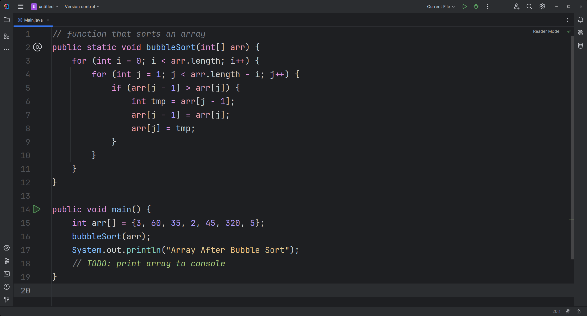
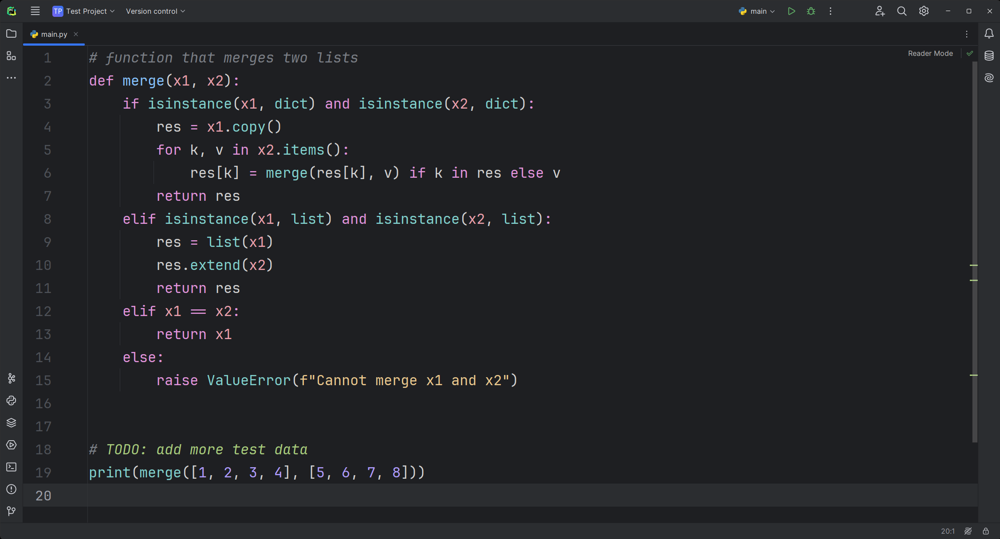
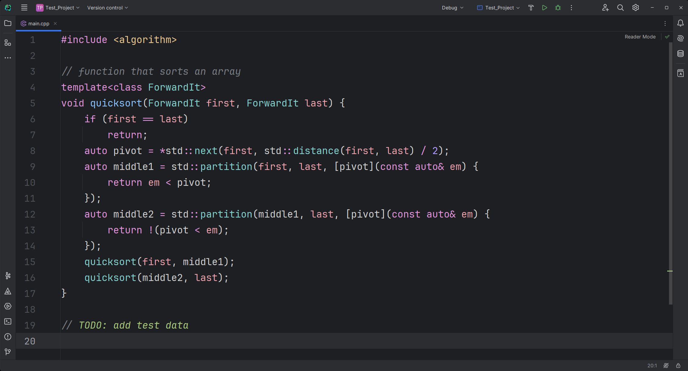

# Fleetokai

**Color scheme for JetBrains IDEs** inspired by <ins>Monokai</ins> theme, but filled with <ins>Fleet Dark</ins> colors

---

## Examples

### Java:

### Python:

### C++:

## Supported IDEs

- **IntelliJ IDEA**
- **PyCharm**
- **CLion**

## Installation

1. Open your IDE
2. Go to _Settings_ -> _Plugins_ -> _Marketplace_
3. Search for "**Fleetokai**"
4. Click _Install_

## License

This project is licensed under the MIT License. See the [LICENSE](LICENSE) file for details.
