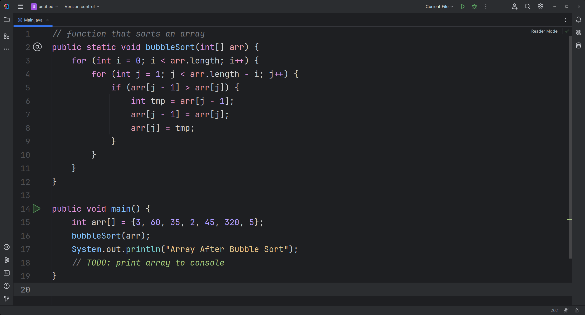
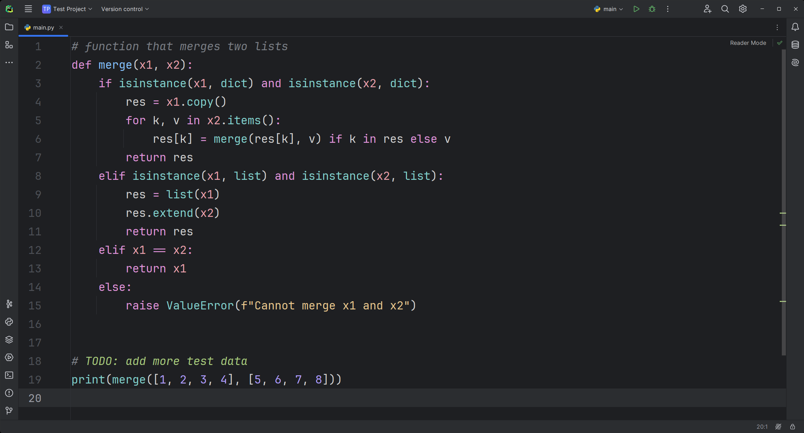
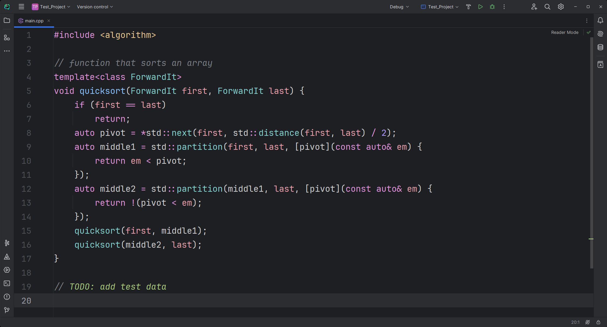

# Fleetokai

**Color scheme for JetBrains IDEs** inspired by <ins>Monokai</ins>, but with <ins>Fleet Dark</ins> colors

---

## Examples

### Java:

### Python:

### C++:

## Supported IDEs

- **IntelliJ IDEA**
- **PyCharm**
- **CLion**

## Installation

1. Open your IDE
2. Go to _Settings_ -> _Plugins_ -> _Marketplace_
3. Search for "**Fleetokai**" and install it
4. Go to _Settings_ -> _Appearance & Behavior_ -> _Appearance_ -> _Theme_
5. Search for "**Dark**" and choose it
6. Go to _Settings_ -> _Editor_ -> _Color Scheme_ -> _Scheme_
7. Search for "**Fleetokai**" and choose it
